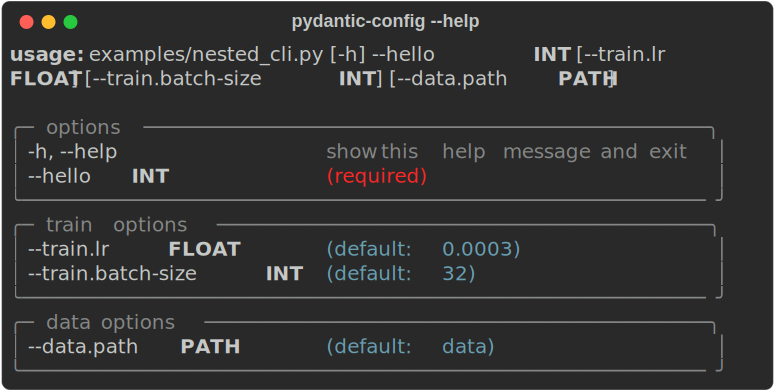
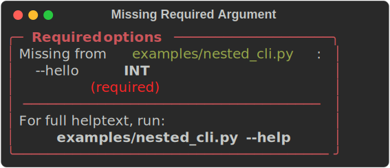
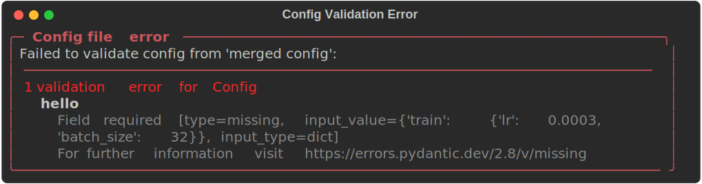
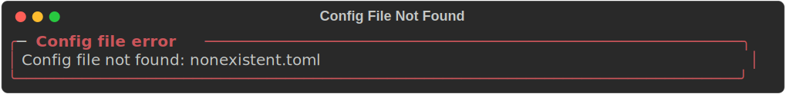

# Pydantic Config

A drop-in replacement for `tyro.cli` with TOML/YAML/JSON config file support.

```python
# Instead of:
from tyro import cli

# Use:
from pydantic_config import cli
```

Built on top of [tyro](https://brentyi.github.io/tyro/) for type-safe CLI parsing and [Pydantic](https://docs.pydantic.dev/) for validation.

## Install

```bash
pip install git+https://github.com/samsja/pydantic_config
```

For TOML support (recommended):
```bash
pip install "pydantic_config[toml] @ git+https://github.com/samsja/pydantic_config"
```

## Quick Start

```python
from pydantic_config import cli, BaseConfig

class TrainConfig(BaseConfig):
    lr: float = 1e-4
    batch_size: int = 32

class ModelConfig(BaseConfig):
    hidden_size: int = 256
    num_layers: int = 4

class Config(BaseConfig):
    train: TrainConfig = TrainConfig()
    model: ModelConfig = ModelConfig()
    hello: int

if __name__ == "__main__":
    config = cli(Config)
```

### Help output

<p align="center">
  
</p>

### Missing required argument

<p align="center">
  
</p>

### Config file validation error

<p align="center">
  
</p>

### Config file not found

<p align="center">
  
</p>

## Config Files

Load config from TOML/YAML/JSON files using the `@` syntax:

```bash
# Load config file
python train.py @ config.toml

# Override values from CLI
python train.py @ config.toml --train.lr 0.001

# Load nested configs from separate files
python train.py --model @ model.toml --train @ train.toml
```

Example `config.toml`:
```toml
[train]
lr = 0.0003
batch_size = 64

[model]
hidden_size = 512
```

CLI arguments always override config file values.

## Development

```bash
uv sync --extra all
uv run pytest
```
